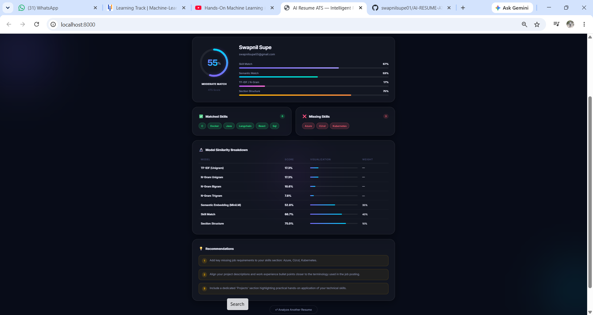

# ⚡ AI Resume ATS — Intelligent Resume Analyzer

> An AI-powered Applicant Tracking System (ATS) that scores your resume against any job description using multi-model NLP & Machine Learning — locally, privately, and in seconds.


---

## 📌 Table of Contents

- [Overview](#overview)
- [Features](#features)
- [Tech Stack](#tech-stack)
- [Project Structure](#project-structure)
- [Scoring Engine](#scoring-engine)
- [🚀 How to Start the Project](#-how-to-start-the-project)
  - [Prerequisites](#prerequisites)
  - [First-Time Setup](#1-first-time-setup)
  - [Start the Server](#2-start-the-server)
  - [Open in Browser](#3-open-in-browser)
  - [How to Stop the Server](#4-how-to-stop-the-server)
- [API Reference](#api-reference)
- [Running Tests](#running-tests)
- [Roadmap](#roadmap)
- [License](#license)

---

## Overview

**AI Resume ATS** is a full-stack application that analyzes a resume PDF against a job description using a combination of NLP and ML models. It replicates how enterprise ATS systems evaluate candidates and gives you a detailed breakdown with actionable recommendations.

Everything runs **100% locally** — no data is sent to external services (except for downloading the sentence-transformer model on first run).

---

## Features

- 📄 **PDF Resume Upload** — Drag & drop or browse to upload your resume
- 📝 **Job Description Input** — Paste any job description text
- ⚡ **Multi-Model NLP Scoring** — Combines 4 independent models for accuracy
- 🎯 **Skill Gap Analysis** — Shows matched and missing skills side-by-side
- 📊 **Model Breakdown Table** — Unigram, Bigram, Trigram, TF-IDF, Semantic scores
- 💡 **Actionable Recommendations** — Specific tips to improve your ATS score
- 🌐 **Modern Web UI** — Glassmorphism dark-mode frontend, no frameworks needed
- 🔌 **REST API** — Clean FastAPI backend, easily integrable

---

## Tech Stack

| Layer | Technology |
|---|---|
| **Backend** | Python 3.10+, FastAPI, Uvicorn |
| **PDF Parsing** | PyMuPDF (fitz) |
| **NLP / ML** | scikit-learn, NLTK, spaCy, Sentence Transformers |
| **Semantic Model** | `all-MiniLM-L6-v2` (Hugging Face) |
| **Frontend** | Vanilla HTML, CSS, JavaScript |
| **Data** | NumPy, Pandas |

---

## Project Structure

```
AI-Resume-ATS/
│
├── README.md
├── backend/
│   ├── run.py                        # Uvicorn entry point
│   ├── requirements.txt              # Python dependencies
│   ├── test.py                       # End-to-end pipeline test script
│   │
│   └── app/
│       ├── main.py                   # FastAPI app setup, CORS, static mount
│       │
│       ├── api/
│       │   ├── __init__.py
│       │   └── routes.py             # POST /api/analyze, GET /api/health
│       │
│       ├── parser/
│       │   ├── pdf_parser.py         # PyMuPDF PDF text extraction
│       │   └── resume_parser.py      # Structured resume section parser
│       │
│       ├── preprocessing/
│       │   └── text_preprocessor.py  # Tokenization, stopword removal, lemmatization
│       │
│       ├── models/
│       │   ├── tfidf_model.py        # TF-IDF cosine similarity
│       │   ├── ngram_model.py        # Unigram / Bigram / Trigram similarity
│       │   └── embedding_model.py    # Sentence Transformer semantic similarity
│       │
│       ├── scoring/
│       │   └── ats_scorer.py         # Weighted ATS score calculation engine
│       │
│       ├── utils/
│       │   └── skills.py             # Skills keyword extraction utility
│       │
│       └── static/
│           ├── index.html            # Frontend SPA
│           ├── style.css             # Glassmorphism dark UI styles
│           └── app.js                # Frontend logic & API calls
│
└── dataset/
    ├── generate_sample_pdf.py        # Script to generate a sample resume PDF
    ├── resumes/
    │   └── swapnil_resume.pdf        # Sample resume for testing
    └── job_descriptions/
        └── ml_engineer_jd.txt        # Sample ML Engineer job description
```

---

## Scoring Engine

The ATS score is calculated using a **weighted combination of 4 models**:

| Model | Weight | Description |
|---|---|---|
| **Skill Match Score** | 40% | Keyword-based skill extraction and intersection |
| **Semantic Similarity** | 35% | Sentence Transformer (`all-MiniLM-L6-v2`) cosine similarity |
| **N-Gram / TF-IDF** | 15% | Bigram overlap + TF-IDF vector similarity |
| **Section Structure** | 10% | Presence of key resume sections (Education, Experience, Projects) |

### Match Levels

| ATS Score | Match Level |
|---|---|
| 80 – 100 | ✅ Excellent Match |
| 65 – 79 | 🟢 Good Match |
| 50 – 64 | 🟡 Moderate Match |
| 0 – 49 | 🔴 Low Match |

---

## 🚀 How to Start the Project

### Prerequisites

- **Python 3.10 or higher** installed on your machine
- **pip** (Python package manager)
- **Git** (optional, to clone the repo)

---

### 1. First-Time Setup

Run these commands in your terminal or PowerShell from the root folder (`AI-Resume-ATS`):

#### Step A: Open terminal in project root
```bash
cd AI-Resume-ATS
```

#### Step B: Create and activate virtual environment
- **Windows (PowerShell / Command Prompt):**
  ```powershell
  python -m venv venv
  .\venv\Scripts\activate
  ```
- **macOS / Linux:**
  ```bash
  python3 -m venv venv
  source venv/bin/activate
  ```

#### Step C: Install dependencies
```bash
cd backend
pip install -r requirements.txt
```

#### Step D: Download required NLP models (One-time only)
```bash
python -m spacy download en_core_web_sm
python -c "import nltk; nltk.download('stopwords'); nltk.download('punkt'); nltk.download('wordnet')"
```

> **Note:** The Sentence Transformer model (`all-MiniLM-L6-v2`) will be downloaded automatically (~90 MB) when the server starts or the first analysis is triggered.

---

### 2. Start the Server

Whenever you want to start the project:

```bash
# 1. Ensure you are in the backend directory
cd AI-Resume-ATS/backend

# 2. Activate virtual environment (if not already active)
# Windows:
..\venv\Scripts\activate
# macOS/Linux:
source ../venv/bin/activate

# 3. Start the application
python run.py
```

You will see output similar to:
```
INFO:     Uvicorn running on http://0.0.0.0:8000 (Press CTRL+C to quit)
INFO:     Started reloader process
INFO:     Application startup complete.
```

---

### 3. Open in Browser

Once the server is running, open your web browser and visit:

👉 **[http://localhost:8000](http://localhost:8000)**

1. **Upload Resume:** Drag and drop or browse to select your PDF resume.
2. **Job Description:** Paste the job description text into the text box.
3. **Analyze:** Click the **⚡ Analyze Resume** button.
4. **Results:** View your ATS score ring, matched/missing skills, model breakdowns, and recommendations!

---

### 4. How to Stop the Server

To stop the running application, press **`Ctrl + C`** in your terminal.

---

## API Reference

### `GET /api/health`

Health check endpoint.

**Response:**
```json
{
  "status": "ok",
  "service": "AI Resume ATS"
}
```

---

### `POST /api/analyze`

Analyze a resume PDF against a job description.

**Request:** `multipart/form-data`

| Field | Type | Description |
|---|---|---|
| `resume_file` | File (PDF) | Resume PDF file (max 5 MB) |
| `jd_text` | string | Full job description plain text |

**Sample Response:**
```json
{
  "candidate_name": "John Doe",
  "email": "john@example.com",
  "ats_score": 78,
  "match_level": "Good Match",
  "skill_match_score": 85.0,
  "semantic_score": 72.4,
  "tfidf_score": 68.1,
  "ngram_score": 71.3,
  "ngram_breakdown": {
    "unigram_score": 74.2,
    "bigram_score": 71.3,
    "trigram_score": 65.8
  },
  "section_score": 100.0,
  "matched_skills": ["python", "machine learning", "sql"],
  "missing_skills": ["kubernetes", "spark"],
  "total_jd_skills_count": 5,
  "recommendations": [
    "Add key missing job requirements to your skills section: kubernetes, spark.",
    "Align your project descriptions closer to the terminology used in the job posting."
  ]
}
```

**Error Responses:**

| Status Code | Reason |
|---|---|
| `400` | Non-PDF file uploaded or empty JD text |
| `422` | PDF has no extractable text (scanned / image-only PDF) |
| `500` | Internal scoring engine error |

---

## Running Tests

An end-to-end pipeline test script verifies that all NLP models are working correctly:

```bash
# From the backend/ directory with venv activated
python test.py
```

This script runs:
1. **PDF Text Extraction** — Verifies PyMuPDF can parse the sample resume
2. **Structured Resume Parsing** — Checks name, email, phone, and skills detection
3. **Comparative Model Analysis** — Runs all 4 models and prints the full ATS report

---

## Roadmap

- [ ] Add support for DOCX resume uploads
- [ ] Export ATS report as PDF
- [ ] Batch resume analysis (compare multiple candidates at once)
- [ ] Resume keyword density heatmap visualization
- [ ] User authentication & history of past analyses
- [ ] Docker containerization for easy deployment

---

## License

This project is licensed under the **MIT License**.

---

<div align="center">
  <strong>Built with ❤️ using FastAPI, Sentence Transformers & Vanilla JS</strong>
</div>


